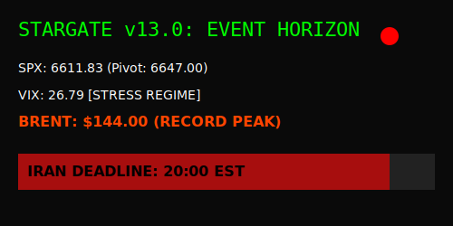
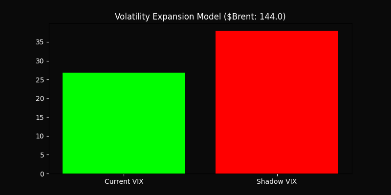

# 🌌 Stargate v13.0: Event Horizon
### Geopolitical Inflection Suite | April 7, 2026
**Current Status:** [BEARISH CONTROL] 🔴
**Deadline:** 20:00 EST / 21:00 BRT (Iran / Strait of Hormuz)

---

## 📊 Live Telemetry Dashboard
This SVG is dynamically generated by the **Java 26 Virtual Thread Node** to monitor news-feed latency and market pivots.

---

## 📈 Volatility Expansion Model (Shadow VIX)
Generated by **Python 3.15**, this chart projects the non-linear "Shadow VIX" based on the **$144.00 Brent Physical Peak** model.

---

## 🛠 Cluster Architecture
| Node | Technology | Function |
| :--- | :--- | :--- |
| **Engine** | **C++26 (SIMD)** | Real-time 200DMA breach detection (SPX 6611.83). |
| **Monitor** | **Java 26 (Loom)** | High-concurrency virtual threads for deadline listening. |
| **Analytics** | **Python 3.15** | Risk-regime modeling and visual asset generation. |

### Execution
1. `source stargate_venv/bin/activate`
2. `./stargate_node`
3. `java RiskMonitor`
4. `python3 shadow_vix.py`

---
*Synchronized at 17:23 BRT - Standing by for the Event Horizon.*
