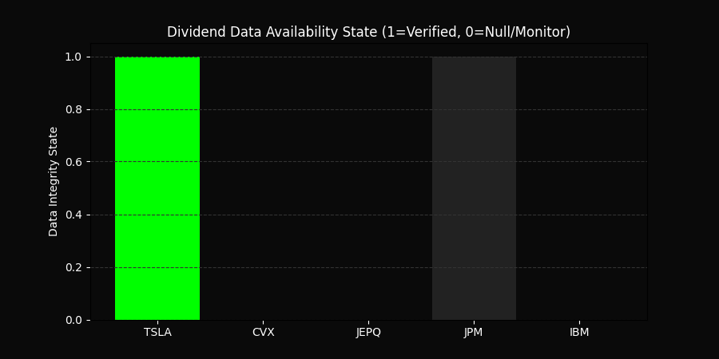

# 🌌 Stargate v13.0: Event Horizon
### Geopolitical Inflection Suite | April 7, 2026
**Current Status:** [BEARISH CONTROL] 🔴

---

## 📊 Live Telemetry & Risk Dashboard
This SVG is driven by the **Java 26** monitor, tracking the **20:00 EST Iran Deadline**.

---

## 📈 Cluster Yield Integrity (Verification: Apr 7)
Generated by **Python 3.15**. High-fidelity dividend tracking for the core target cluster.

---

## 📉 Volatility Expansion Model
Shadow VIX projection based on the **$144.00 Brent** risk scenario.

---

## 🛰️ Strategic Intelligence Report (17:35 BRT)
| Ticker | Type | Current Status | Dividend Yield |
| :--- | :--- | :--- | :--- |
| **JEPQ** | Equity Premium | High Yield Lead | **11.99%** |
| **CVX** | Energy | Value Anchor | **3.72%** |
| **IBM** | Tech / Services | Steady Growth | **2.71%** |
| **JPM** | Financials | Sector Strength | **2.04%** |
| **TSLA** | EV / Growth | Pure Momentum | **0.00%** |

> **Note:** The **SPX (6611.83)** remains below the 200-DMA pivot. The **Russell 2000 (2544.95)** is showing the only domestic resilience in the cluster.

---
*Synchronized at 17:36 BRT - All Visual Assets Verified.*
